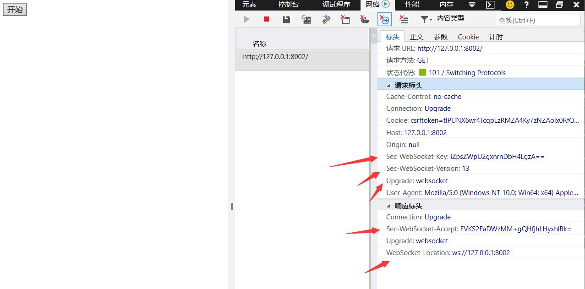

### 轮询

```
轮询，在前端通过写js实现。缺点：有延迟、服务器压力大。
```

### 长轮询

```
首先需要为每个用户维护一个队列，用户浏览器会通过js递归向后端自己的队列获取数据，自己队列没有数
据，会将请求夯住（去队列中获取数据），夯一段时间之后再返回。
注意：一旦有数据立即获取，获取到数据之后会再发送请求。
```

```
用户发来请求之后，最多会夯住N秒（30s），因为有消息的时候回立即返回，没有消息时才最多夯N秒。
```

### WebSocket

### WebSocket原理

```
WebSocket 是 HTML5 开始提供的一种在单个 TCP 连接上进行全双工通讯的协议。

WebSocket 使得客户端和服务器之间的数据交换变得更加简单，允许服务端主动向客户端推送数据。在 WebSocket API 中，浏览器和服务器只需要完成一次握手，两者之间就直接可以创建持久性的连接，并进行双向数据传输。

在 WebSocket API 中，浏览器和服务器只需要做一个握手的动作，然后，浏览器和服务器之间就形成了一条快速通道。两者之间就直接可以数据互相传送。

现在，很多网站为了实现推送技术，所用的技术都是 Ajax 轮询。轮询是在特定的的时间间隔（如每1秒），由浏览器对服务器发出HTTP请求，然后由服务器返回最新的数据给客户端的浏览器。这种传统的模式带来很明显的缺点，即浏览器需要不断的向服务器发出请求，然而HTTP请求可能包含较长的头部，其中真正有效的数据可能只是很小的一部分，显然这样会浪费很多的带宽等资源。

HTML5 定义的 WebSocket 协议，能更好的节省服务器资源和带宽，并且能够更实时地进行通讯。
```


```javascript
浏览器通过 JavaScript 向服务器发出建立 WebSocket 连接的请求，连接建立以后，客户端和服务器端就可以通过 TCP 连接直接交换数据。

当你获取 Web Socket 连接后，你可以通过 send() 方法来向服务器发送数据，并通过 onmessage 事件来接收服务器返回的数据。

以下 API 用于创建 WebSocket 对象。

var Socket = new WebSocket(url, [protocol] );

以上代码中的第一个参数 url, 指定连接的 URL。第二个参数 protocol 是可选的，指定了可接受的子协议。
```

#### 总的来说，具体的流程如下

> 1. 客户端向服务端发送随机字符串，在http的请求头中放入`Sec-WebSocket-Key `随机字符串
>
> 2. 服务端接收到随机字符串
>
>    1. 随机字符串+魔法字符串
>    2. sha1加密
>    3. base64加密
>    4. 放在响应头中给用户返回`Sec-WebSocket-Accept`
>
> 3. 客户端浏览器会进行校验，校验不通过，说明服务端不支持websocket
>
> 4. 客户端和服务端进行相互收发消息，数据加密和解密
>
> 5. 解密细节：
>
>    1. 获取第二个字节的后7位(最大为127)，payload len
>
>    2. 判断payload len的值
>
>       1. = 127
>
>          ```
>          2 字节 + 8 字节 + 4 字节 + 数据
>          ```
>
>       2. = 126
>
>          ```
>          2 字节 + 2 字节 + 4 字节 + 数据
>          ```
>
>       3. <= 125
>
>          ```
>          2 字节 + 4 字节 + 数据
>          ```
>
>    3. 使用masking key对数据进行解密(masking key是全球公认的)

效果图

**点击开始之后，发送了一个http请求，头部就有Sec-WebSocket-Key随机字符串**

